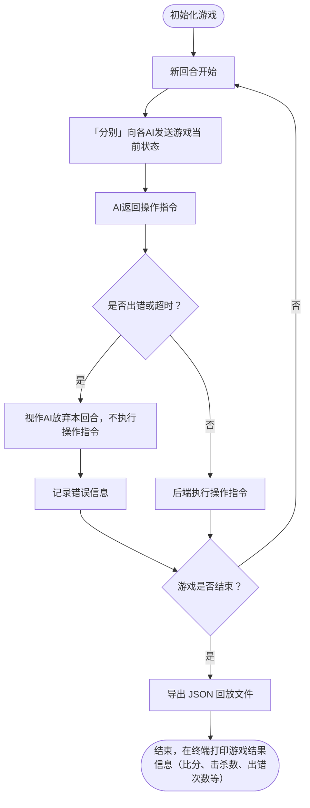
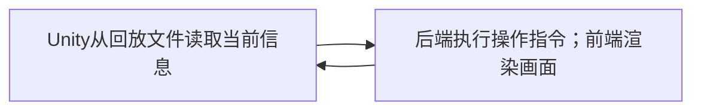
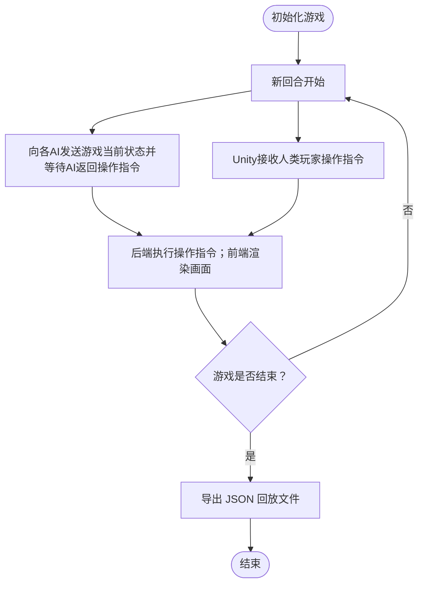
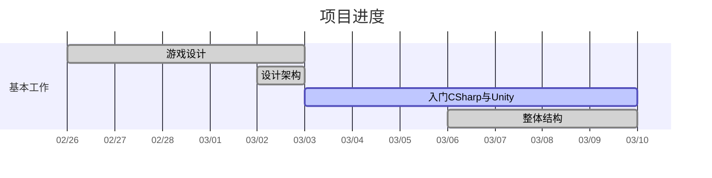

# THUAI6

## 架构分析

主要使用 Unity 引擎开发。考虑到 Unity 中很多我们需要的功能是开箱即用的，故倾向于 All in Unity。且这也便于后续得到一个支持引入人类玩家的「单机游戏」。

需至少支持使用 C++ 编写 AI。

比赛需要能够回放，且每次回放的结果应该是确定的。故比赛运行完成后，导出 JSON 格式的回放文件，回放时直接读取文件，不再调用 AI。

### 流程图

#### 评测时

#### 回放时

#### 现场对战时（如含有人类玩家）

希望架构具有足够扩展性，如允许后续开发「让人类玩家参与」的功能（如让开发者能够亲自体验自己开发的游戏、让校内外观众能够体验选手开发的AI的强度、作为单独的游戏在THUAI结束后仍有游玩价值）。

AI必须支持使用C/C++编写，未必是C#；而人类玩家的操作在前端接收，使用的是C#。

### AI与游戏主体的通信

要求方案能跨平台通用，故 `C++/CLI`不可行。且要足够简单。

- 编译为C的动态链接库，在 C# 中使用 `DllImport` 即可像调用 C#函数 一样调用。Unity文档：[Native Plugins](https://docs.unity3d.com/Manual/NativePlugins.html)。
- 搭建本地Web服务器。（自动化系今年的方案）
  - 优点：顺便预防了AI的作弊行为（如直接读取游戏内存），且很容易扩展到支持使用其他编程语言编写AI，如Python。
  - 缺点：工作量相对较大；需要额外的网络通信开销；只能通过JSON传递数据，不够高效。
  - 目前初步测定网络通信开销在可接受范围内，故可能是个可行的方案。

经部员讨论，选择「同步调用」而非「异步调用」，不允许AI延迟返回操作指令。

### 关于回放

回放文件使用 JSON 格式。记录每个回合的游戏状态与各个AI的操作指令。

优化文件大小：默认用不填写表示该操作与上回合相同。

若必要（虽然估算了文件大小是完全可接受的），也可压缩后存储。

### SDK

[SDK文档](docs/SDK文档.md)

## 开发管理

时间很紧，需要尽快完成。

接下来**四周**左右时间内，我们每周都要开一次例会交流进展。经会议上的投票，时间定在每周五晚22:00到23:00。会议之后即是周末，可以充分利用周末的时间进行开发。
例会主要内容：分享自己这周完成了什么、接下来做什么、有什么需要讨论/帮助的地方。

通过 GitHub 进行项目管理。开发时，每个人在自己的分支上进行开发，开发完成后发起合并到主分支的 Pull Request。Pull Request 最好经过他人 ReView 后再合并。最好 Watch 本项目，以便及时收到 Pull Request 的通知。

负责特定模块的同学可以在 [项目进度记录](#项目进度记录) 中记录自己的进度。

[C# 编码约定 | Microsoft Learn](https://learn.microsoft.com/zh-cn/dotnet/csharp/fundamentals/coding-style/coding-conventions)

## 一些实现方案

地图：tilemap

射击：

方案1：实体子弹。生成同方向的固定速度的子弹，并为之添加碰撞事件。可借鉴此视频：[使用Unity制作俯视角射击游戏](https://www.bilibili.com/video/BV1xb4y1D7PZ/)，参考其中部分内容的思路。
方案2：子弹无移动过程、即发即中。射线检测，可参考此文章：[简析Unity射线检测的概念与应用](https://zhuanlan.zhihu.com/p/421534861)

## 项目进度记录

